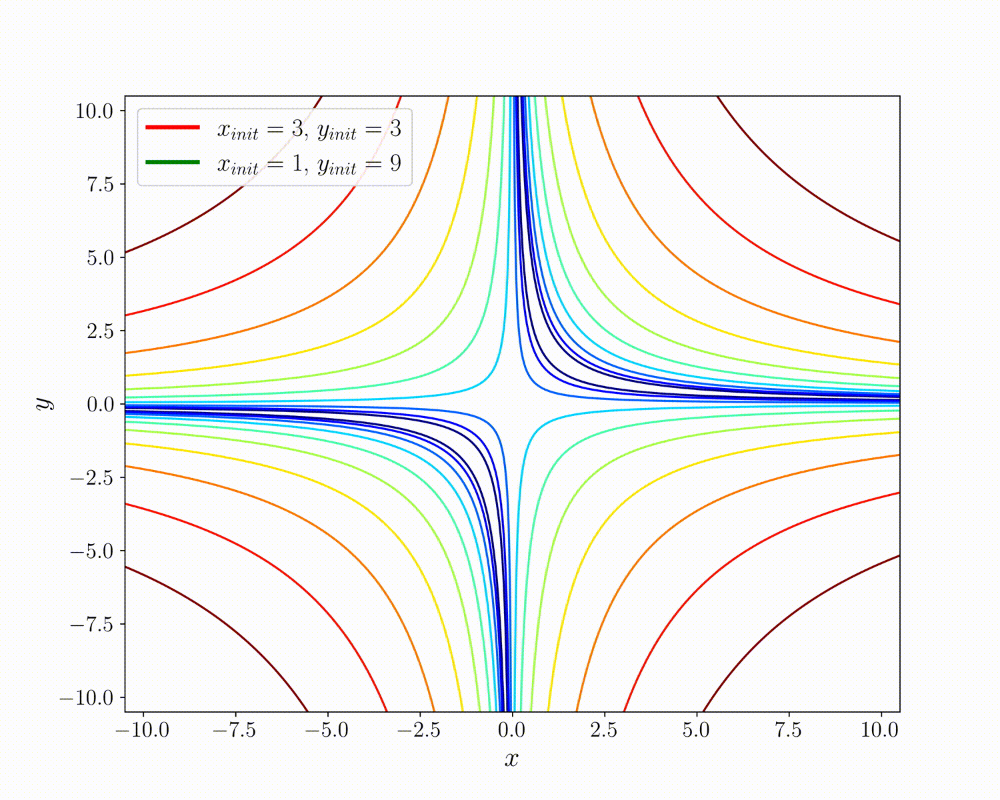
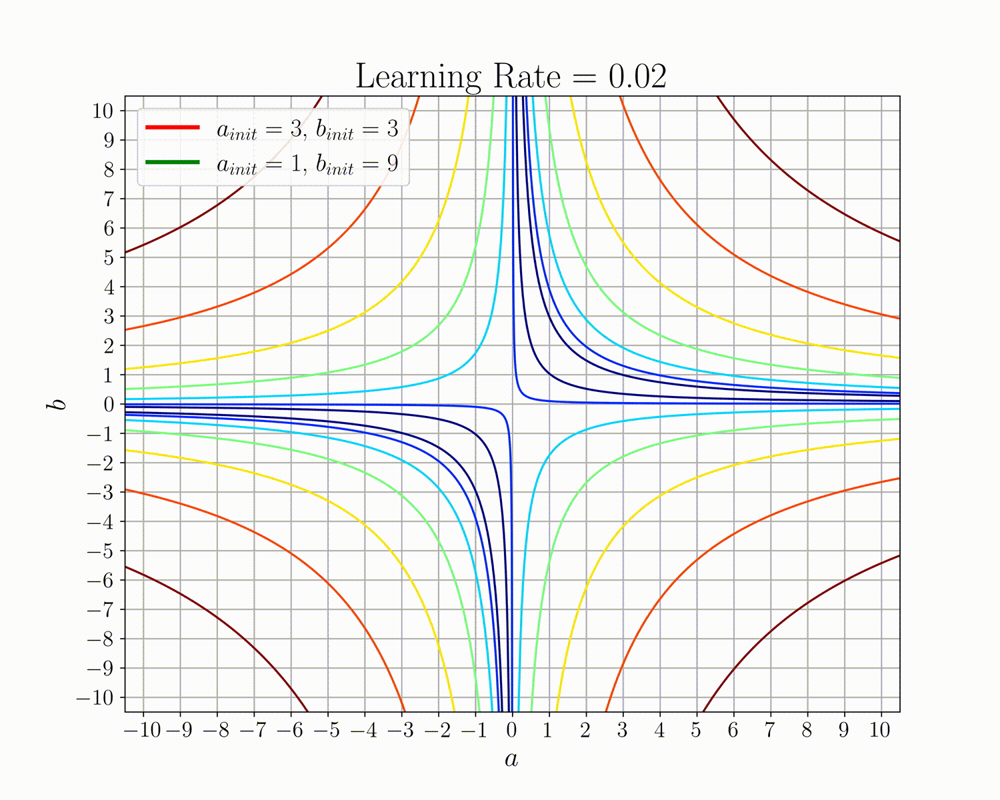
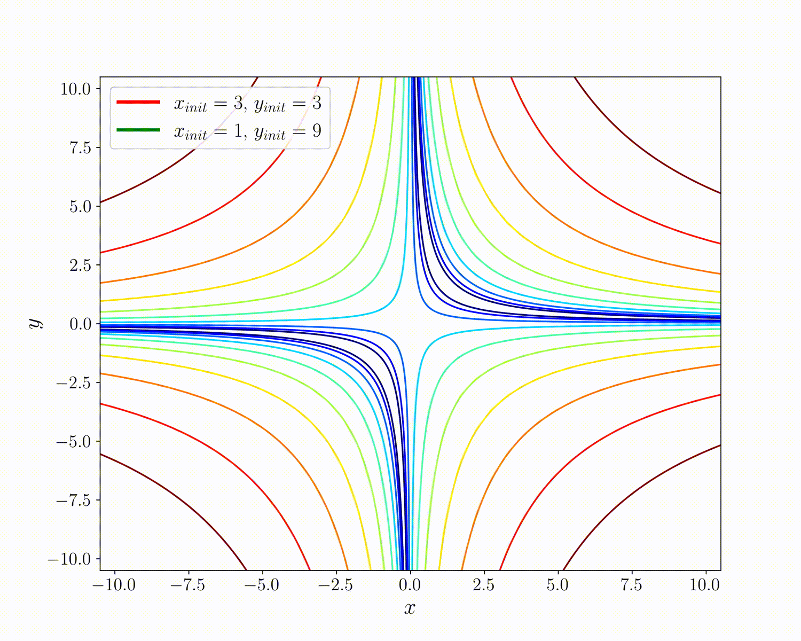

# The Effect of Weight-Space Symmetry on Training DNNs

### About
This repository studies the effect of the weight-space symmetry property in Deep Neural Networks on training. It is relatively well-known that DNNs (depending on the used activation function) have many symmetrical points in their weight space (weights that produce the same mapping). This property of DNNs is explained in Bishop's book "Pattern Recognition and Machine Learning". Although symmetrical points produce exact functional mapping, a single gradient update on two symmetrical points leads to different (unsymmetrical) points. Here we analyze the effect of weight-space symmetry in DNNs with ReLU activations, where a given DNN has infinite equivalents.

### Motivational Example
To motivate this, let us consider the following simple over-parameterized function 

$$f(x) = a \cdot b \cdot x$$

Note that the two points $(a,b) = (3,3), (1, 9)$ are symmetrical as they lead to the same mapping $f(x) = 9\cdot x$. The following figures show how the optimization progress when minimizing the loss 

$$\underset{a,b}{min} \; (a \cdot b \cdot x - 2)^2$$

starting from two symmetrical points $(a,b) = (3,3), (1, 9)$ and using different learning rates. The minimizer for this loss function is clearly all points satisfying $a \cdot b = 2$. We can see that the two symmetrical points result in totally different behavior. The optimization for the initial point $(a,b) = (1, 9)$ is less stable for the learning rate $0.02$ and diverges for the learning rate $0.025$.

##### Learning Rate = 0.01

##### Learning Rate = 0.02

##### Learning Rate = 0.025

##### Acknowledgement
The code used for creating the animation was based on [this repository](https://github.com/ilguyi/optimizers.numpy) by Il Gu Yi.